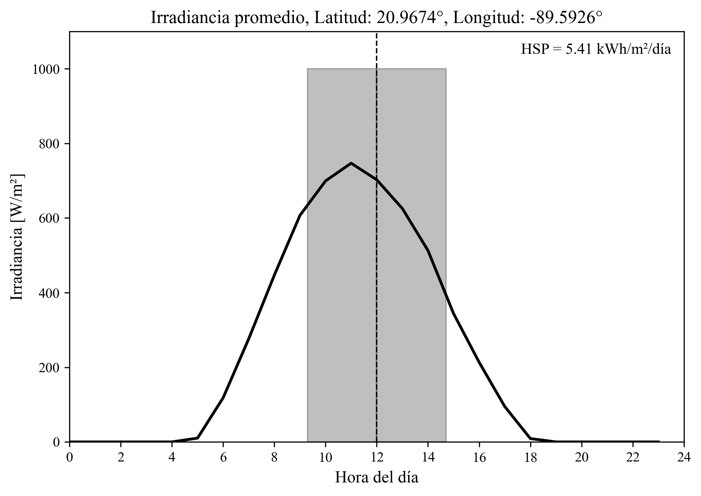
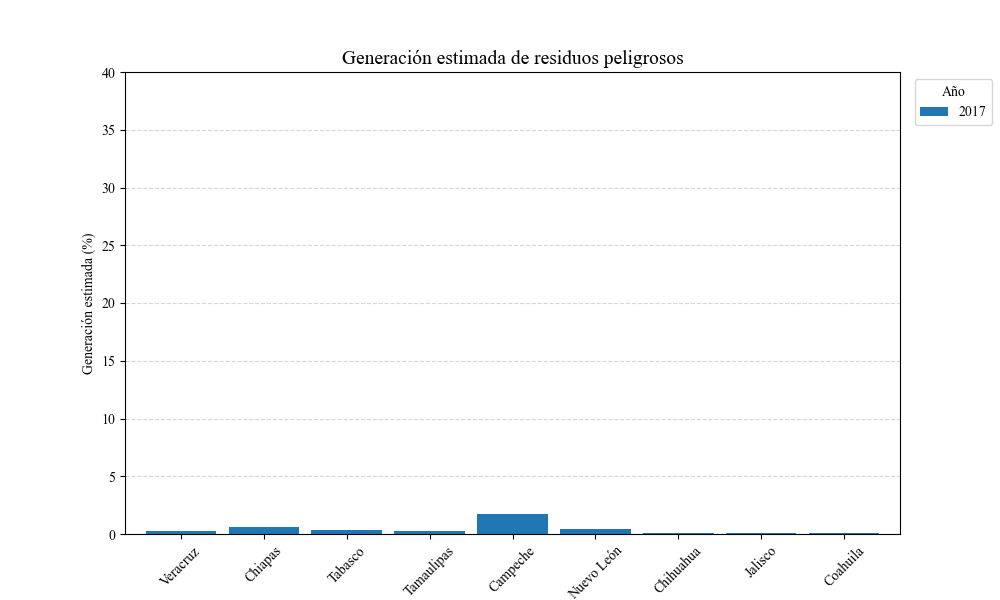
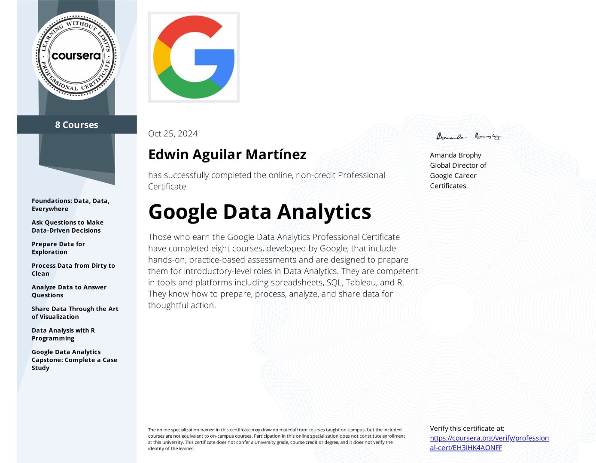
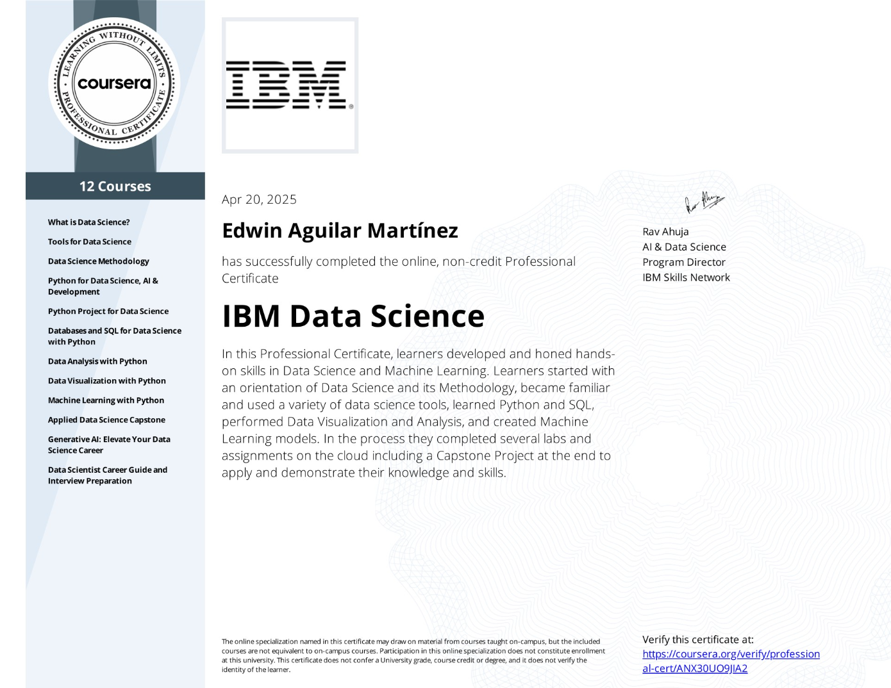
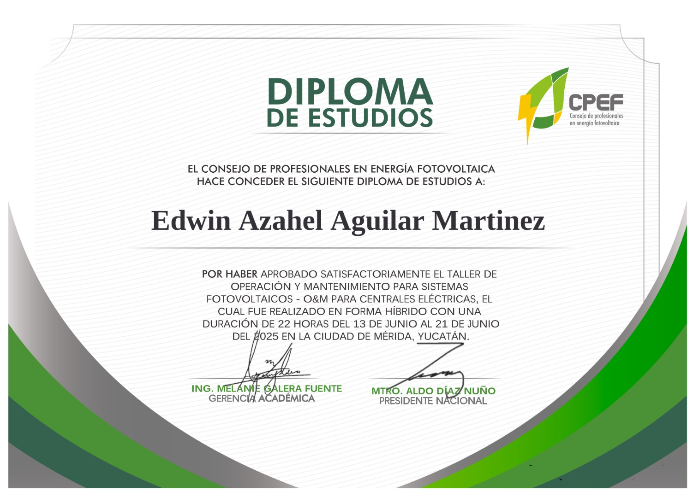

# 👋 Hola, soy Edwin Azahel Aguilar Martínez

🎓 Estudiante de **Ingeniería en Energías Renovables** (UADY)  
📊 Enfocado en **Ingeniería de Datos** y **Ciencia de Datos** aplicados al sector energético  

---

## Presentación
Soy estudiante de ingeniería en energías renovables con enfoque en **datos**.  
He realizado proyectos de **análisis, limpieza y extracción de datos**, aplicando Python, Jupyter Notebook y entornos SQL. Me interesa trabajar en proyectos que impliquen **gestión y análisis de datos**.  

En el área de **energías renovables** manejo software de ingeniería para **CFD, CAD y simulaciones mecanicas**, además de conocer la normativa eléctrica, análisis económico-energético, generación de energía y transmisión energética.  

Actualmente me capacito en **ingeniería de datos**, **ciencia de datos**, **financiamiento de proyectos**, y en fundamentos de **inteligencia artificial** aplicada al análisis.  

---

## 📂 Proyectos personales
🌞 **Horas Sol Pico (HSP)**: análisis y estimación de radiación solar en Mérida con datos históricos.  

  

🏭 **Residuos peligrosos en plantas petroquímicas**: limpieza y análisis de una base de datos sobre aguas contaminadas.  

  

👉 Busco seguir creando proyectos que aporten valor a mi portafolio y fortalezcan mis conocimientos en datos y energía.  

## 🌱 Intereses
- **Datos**: ingeniería de datos, big data, inteligencia artificial  
- **Energía**: IoT, smart grids, energía solar conectada a red, simulación eólica  
- **Idiomas**: actualmente estudio **chino** para expandir mis horizontes académicos y profesionales 

## 🛠️ Tecnologías y herramientas
- **Lenguajes**: Python, SQL 
- **Ingeniería**: SolidWorks, ANSYS, AutoCAD 
- **Otros**: Excel (macros)

## 📫 Contacto
✉️ edagmar2000@gmail.com  
🔗 [LinkedIn]([https://www.linkedin.com/](https://www.linkedin.com/in/edwin-azahel-aguilar-mart%C3%ADnez-685b41248/)) 
📱 +52 990 369 4516

  # 📜 Certificados

## **Análisis de Datos – Google**  

  

## **Ciencia de Datos – IBM**  

  

## **Educación Financiera – CONDUSEF**  

  

## **O&M en Sistemas Fotovoltaicos – CPEF**  

  
